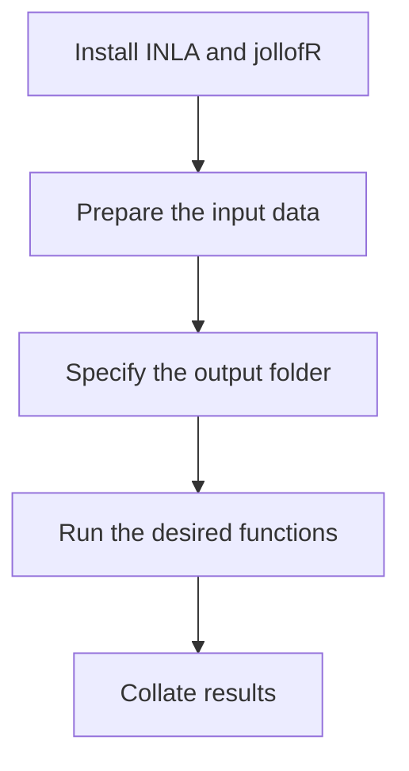
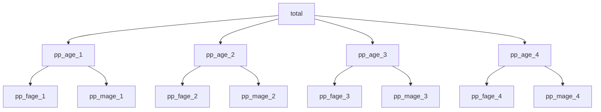

# 1. Background
**jollofR** version 0.3.0 is an R package that enables rapid disaggregation of small area population estimates into demographic groups such as age and sex groups as well as other socio-demographic and socio-economic categories (e.g., marital status, wealth indices, educationa level, race, etc). It facilitates the filling of important population data gaps especially across settings where census data are either outdated or incomplete. **jollofR** is based on advanced multi-steps Bayesian hierarchical statistical modelling approach which first estimates the proportions of each demographic group’s composition within the population of interest based on a (often partially observed) sample data, and then uses it to disaggregate the total population estimate for each administrative unit within the population. **jollofR** also includes functions to easily disaggregate the population proportions and population numbers at high-resolution grid cells (e.g., 100m by 100m) along with the corresponding estimates of uncertaintity thereby facilitating evidence-based decision-making at small area units. It is **fully automated and does not require any special skills or deep knowledge in statistics or statistical modelling**, and the input population datasets could come from various sources including census, census projections, Microcensus, household surveys and administrative records.

This statistical model-based approach allows us to estimate population proportions and population counts across all the demographic units of interest including at locations with no observations within the sample data. The use of Bayesian inference approach enables easy quantification of uncertainties in the model parameter estimates based on the 95% credible interval of the posterior distribution. Within the **jollofR** package, the posterior inference is formulated on the integrated nested Laplace approximation (INLA; Rue et al., 2009) techniques in conjunction with the stochastic partial differential equation (SPDE; Lindgren et al., 2011) strategies, thereby enabling significantly high computational speed. This helps to position the **jollofR** package as a fast and efficient tool for the rapid production of spatially-structured (e.g., age, sex, ethnicity, wealth, education) population counts and population proportions at small area scales often required for evidence-based governance and more effective humanitarian response efforts. The package is specifically designed to support population data producers and users as well as policymakers in providing timely and spatially detailed small area population data for filling population data gaps across many settings where census is unaffordable due to high cost or where a recent census is incomplete due to the presence of 'hard-to-reach' or 'hard-to-count' areas as a result of widespread conflicts/unrests or other reasons. 

Altogether, the **jollofR** package contains 14 'simplified' functions and a 'toy' dataset to illustrate its implementations across different scenarios. These include functions for population prediction and disaggregation at the administrative units level ('cheesecake', 'cheesepop', 'spices' & 'slices') and those used for disaggregation at grid-cell level ('sprinkle', 'sprinkle1', 'splash', 'splash1', 'spray' & 'spray1'). Other functions ('boxLine', 'plotHist', 'plotRast' & 'pyramid') available within the **jollofR** package are used for data visualization which enable quick visual assessments of the disaggregated estimates. These functions which are embedded within a robust statistical modelling framework automatically create subnational demographically structured population counts and proportions tables as well as the corresponding high-resolution grid cell raster files in a very simple and efficient manner. 

Further details on these functions, their arguments, usage and examples are provided in **Section 5** of this document, while further details on the underlying statistical methods are provided in **Section 9**.  Finally, while **jollofR** could be used to disaggregate population counts and population proportions across any mutually exclusive and exhaustive groups, here, our data description and usage examples are based on age-sex disaggregation, for ease of exposition. Note that, 'mutually exclusive' means that every individual within the population is only allowed to belong to one of the non-overlapping groups, while 'exhaustive' means that every individual within the entire population must belong to one of the groups and no one is left out. The **jollofR** functions are designed to be fully flexible to allow for a straightforward implementation for other socio-economic and socio-demographic groups so long as the 'mutually exclusive and exhaustive' requirements are met.  

# 2. Installation

## System Requirements

Before installing **jollofR**, please ensure that your system meets the following requirements:

1.  **R version**: \>= 4.1.0
2.  **INLA** (please check that you have INLA already installed)

### Platform-Specific Setup

### Windows

1.  Install Rtools (matches your R version):
``` r
# Check if Rtools is installed and properly configured
pkgbuild::has_build_tools()
```

If FALSE, download and install Rtools from: [CRAN Rtools](https://cran.r-project.org/bin/windows/Rtools/)

### macOS

1.  Install Command Line Tools:

```         
xcode-select --install
```

2.  Alternatively, install gcc via Homebrew:

```         
brew install gcc
```

### Linux (Ubuntu/Debian)

1.  Update your system and install necessary packages:

```         
sudo apt-get update
sudo apt-get install build-essential libxml2-dev
```

## Install from GitHub

Once the setup is complete, follow the instructions below to download **jollofR**. Note that the package is still under development. So, we will show you how to install the development version and how to install it once it becomes available on CRAN. 

First, you may need to install **INLA** by running the following codes (if you do not have INLA already installed)
```{r eval=FALSE, include=TRUE}
# install.packages("devtools")
install.packages("INLA", repos=c(getOption("repos"),
                                 INLA="https://inla.r-inla-download.org/R/stable"), dep=TRUE)
```
After confirming that **INLA** has been successfully installed, please install the development version of **jollofR** package from GitHub using the following codes: 
```{r eval=FALSE, include=TRUE}
# install.packages("devtools")
devtools::install_github("wpgp/jollofR")
```

## Install from CRAN
As soon as **jollofR** becomes available on CRAN, you can then install it directly from CRAN using the following:
```{r eval=FALSE, include=TRUE}
# install.packages("jollofR")
```

## Other dependencies
In addition to **INLA** package, you may also need to confirm that you have the following packages installed successfully after installing **jollofR**
```{r eval=FALSE, include=TRUE}
library(ggplot2) # use install.packages("ggplot2") to install, if not available
library(dplyr)   # use install.packages("dplyr") to install, if not available
library(terra)   # use install.packages("terra") to install, if not available
library(raster)  # use install.packages("raster") to install, if not available
```

# 3. Workflow Overview
**jollofR** is designed to provide a very simple, efficient and statistically robust appraoch for providing disaggregated population counts across various demographic groups at operational admnistrative unit levels thus making it handy for the production of rapid demographically structured small area population counts. The **jollofR** package allows for population disaggregation with or without geospatial covariates. However, note that these geospatial covariates are those indentified *apriori* to significantly predict population distributions (functions which allow for wider range of geospatial covariates and automatically selects and retains the best fit covariates within the package are being developed by the authors). In all cases, estimates of uncertainties are also produced, and boxplots, line graphs, maps, and age-sex pyramid graphs (for age-sex disaggregations) are automatically generated. Below is the flowchart (Figure 1) for the key stages involved in the implementation of the **jollofR** package.


#### Figure 1: Flowchart of jollofR implementation steps.


##  Initialise

As a first requirement, you will need to do the following: 1) ensure that you have **INLA** and **jollofR** packages installed; 2) create your output folder which is where all the model outputs (results) will be saved, and check to confirm that it works; 3) prepare your input data to ensure it conforms with the input data structure requirements (see the simple data format described within the **Preparing the input data** section). Once all the initial checks are completed (INLA & jollofR installed and working, input data prepared in the correct formats and structure), you are set to start! Please note that while R GUI could be used, RStudio is highly recommended as it makes it easier to monitor the progress of the computations. 

##  Creating output folder
This is where all the automatically produced outputs will be saved on your machine:
```r
output_dir <- "your output directory"
```
The package will create the folder if it does not already exist. 

##  Preparing the input data
The input data 'df' is a .csv file data frame which contains the key variables of the interest. The data is often a completely anonymized aggregated population data with the following fields:

-   **id**: a numeric variable used as the indentification number for each administrative unit (mandatory).

-   **x1, ..., xn**: n geospatial covariates identified for the covariates-based modelling, i.e., for population disaggregation using covariates. In the 'toydata' used as an example here, only 3 geospatial covariates x1, x2, x3 were used for the purpose of illustration only.
The package allows for as many covariates as possible in the model. However, please note that the use of covariates to disaggregate a model-based total population estimates, couls lead to circularity issues. Examples of these geospatial covariates include night time light intensity, distance to market, etc - mandatory if disaggregating based on covariates or optional if disaggregating without covariates.

-   **total**: an integer valued variable which contains the values to be disggregated. It is the total number of individuals per given administrative unit. Check to ensure that *total* has values across all the administrative unit of interest. You may wish to first predict all missing total values (mandatory).

-   **age_1, ....., age_n**: n age groups of interest containing observed population counts per age group per administrtaive unit. Note that *age_1, ....., age_n* can come from a sample survey, opportunistically generated data or from incomplete census data. **jollofR** predicts any missing age proportion, and the these are used to disaggregate the *total* population count. - *mandatory*

-   **fage_1, ....., fage_n**: n age groups of interest containing observed population counts per age group of females per administrtaive unit. Note that *fage_1, ....., fage_n* can come from a sample survey, opportunistically generated data or from incomplete census data. **jollofR** predicts any missing age proportion, and the these are used to disaggregate the *total* population count.- *mandatory*

-   **mage_1, ....., mage_n**: n age groups of interest containing observed population counts per age group of males per administrtaive unit. Note that *mage_1, ....., mage_n* can come from a sample survey, opportunistically generated data or from incomplete census data. **jollofR** predicts any missing age proportion, and the these are used to disaggregate the total population count.


# 4. Toy data

## Toydata 
### Description
Artificially generated toy datasets that come in a cross-sectional format. The 'admin' data is a dataframe collated at administrative unit level which contains information on the observed number of individuals per group (e.g., age and sex groups) within each administrative unit. Key variables include the administrative unit identifier (admin_id), the admin total population to be disaggregated (total), the total number of buildings within each admin unit (bld), and the longitude (lon) and latitude (lat). The 'admin' data provides artificial information for 900 spatially distinct administrative units in which the individuals in the population are grouped into 12 mutually exclusive and exhaustive age groups. Each of the age groups was further grouped into 'male' and 'female' groups. The data contains the total population counts (total) for each spatial unit but also contains missing age and sex groups population counts. The model first predicts the population proportions of the missing data and then disaggregates the population totals using the predicted proportions to obtain the predicted population counts for the age and sex groups. Note that the same applies for other demographic groups such as marital status, race, etc.

### Usage
```r
data(toydata)
```
### Format

An object of class "list"- a list object containing two dataframes - an administrative-level dataset (admin) containing partially observed age-sex structured data, and a grid-cell level dataset (grid) for population disaggregation at 1km by 1km grid cells.

- **admin_id**: Available in both the 'admin' and 'grid' datasets. It is a numerical value which serves as the administrative units unique identifier. They should match perfectly for both the 'admin' and grid' datasets
  
- **grd_id**: Available in the 'grid' dataset only. It is a numerical value which serves as the grid cell unique indentifier.
  
- **x1,x2,x3**: These are the samples of geospatial covariates (only required for the 'cheesecake' and the 'slices' functions). Note that these are the covariates identified to significantly predict population distribution among the demographic groups. The package allows the user to include any number of covariates in their own datasets.
  
- **total**: Available in both the 'admin' and 'grid' datasets. It provides estimates of the total population counts to be disaggregated. It DOES NOT necessarily have to be a rowsum of the age groups totals.
  
- **bld**: Available in both the 'admin' and 'grid' datasets. It provides the total number of buildings in each grid cell or administrative unit.
  
- **age_1, ..., age_12**: These correspond to the partially or fully observed number of people for each age group. Note that only 12 age groups are used here for illustration purposes,however, the package can accommodate any number of age or sex or any demographic groups.
  
- **fage_1, ..., fage_12**: These correspond to the partially or fully observed number of females corresponding to each of the age groups. Note that only 12 age groups are used here for illustration purposes,however, the package can accommodate any number of age or sex or any demographic groups.
  
- **mage_1, ..., mage_12**: These correspond to the partially or fully observed number of males corresponding to each of the age groups. Note that only 12 age groups are used here for illustration purposes,however, the package can accommodate any number of age or sex or any demographic groups.
  
- **lon**: Available in both the 'admin' and 'grid' datasets. Provides the value of the longitude of the centroids of the grid cells or admin unit polygons.
  
- **lat**: Available in both the 'admin' and 'grid' datasets. Provides the value of the latitude of the centroids of the grid cells or admin unit polygons.

### Details: 
The 'admin' data is used to fit statistical models to predict subnational population estimates and proportions across various groups, while the 'grid' data is used for the prediction of the disggregatted population structures at high resolution grid cells. Within the **jollofR** package the grid data used within the toydata provides estimates of population numbers and proportions at 1km-by-1km spatial resolution. However, **jollofR** allow for structured population predictions at any spatial resolution of interest. The 'grid' data contains six key variables -  the administrative unit identifier (admin_id) which must be identical to the those in the 'admin' data; the grid cell identifier (grd_id); the total number of people per grid cell (total), if available; the total number of buildings per grid cell (bld), if available; and the longitude (lon) and latitude (lat) variables for the grid cell centroids.


### Example
```r{}
data(toydata)
admin_data <- toydata$admin # subset the admin data
grid_data <- toydata$grid  # subset the grid cell data
```

# 5. Key functions
## 'cheesecake'
### Description
Used to disaggregate small area population estimates by age, sex, and other socio-demographic or socio-economic characteristics (e.g., ethnicity, religion, educational level, immigration status, etc).
It uses Bayesian hierachical statistical models to predict population proportions and population totals across demographic groups. Primarily designed to support users (e.g., National Statistical Offices) in filling population data gaps across various demographic groups due to outdated or incomplete census/population data.

### Usage
```r
cheesecake(df, output_dir)
```
### Arguments
```
df	
A data frame object containing sample data (often partially observed) on age and sex groups population data as well as the estimated overall total counts per administrative unit.

output_dir	
This is the directory with the name of the output folder where the disaggregated population proportions and population totals are automatically saved.
```
### Value
Data frame objects of the output files including the disaggregated population proportions and population totals along with the corresponding measures of uncertainties (lower and upper bounds of 95-percent credible intervals) for each demographic characteristic. In addition, a file containing the model performance/model fit evaluation metrics is also produced.

### Example
```
data(toydata)
result <- cheesecake(df = toydata$admin, output_dir = tempdir())
```

## 'cheesepop'	
### Description
Similar to the 'cheesecake' function, 'cheesepop' disaggregates small area population estimates by age, sex, and other socio-demographic and socio-economic characteristics (e.g., ethnicity, religion, educational level, immigration status, etc), at the administrative unit level. However, unlike the 'cheesecake' function which uses geospatial covariates to predict missing data values, the 'cheesepop' does not require the use of geospatial covariates.
It uses Bayesian statistical models to predict population proportions and population totals for the demographic groups of interest. Primarily designed to help users in filling population data gaps across demographic groups due to outdated or incomplete census data.

### Usage
```r
cheesepop(df, output_dir)
```
### Arguments
```
df	
A data frame object containing sample data (often partially observed) on age and sex groups population data as well as the estimated overall total counts per administrative unit.

output_dir	
This is the directory with the name of the output folder where the disaggregated population proportions and population totals are automatically saved.
```
### Value
Data frame objects of the output files including the disaggregated population proportions and population totals along with the corresponding measures of uncertainties (lower and upper bounds of 95-percent credible intervals) for each demographic characteristic. In addition, a file containing the model performance/model fit evaluation metrics is also produced.

### Example
```
data(toydata)
result <- cheesepop(df = toydata$admin, output_dir = tempdir())
```

## 'pyramid'
### Description
This function creates population pyramid for age and sex output data from the 'cheesecake' or 'cheesepop' functions outputs. It could also be used to visualize observed age-sex compositions.

### Usage
```r
pyramid(female_pop, male_pop)
``` 
### Arguments
```
female_pop	
A data frame containing the disaggregated population estimates for females across all ages groups. considered.

male_pop	
A data frame containing the disaggregated population estimates for males across all ages groups. considered.
```
### Value
A graphic image of age-sex population distribution pyramid

### Example
```
data(toydata)
result <- cheesecake(df = toydata$admin, output_dir = tempdir())
pyramid(result$fem_age_pop,result$male_age_pop)
```
### Making pyramid graph of the observed age-sex data
```
female_pop <- data.frame(toydata %>% dplyr::select(starts_with("fage_"))) # extract females age data
names(female_pop) <- paste0("pp_", names(female_pop)) # rename the variables by adding "pp_" as suffix to the existing names

male_pop <- data.frame(toydata %>% dplyr::select(starts_with("mage_")))# extract males age data
names(male_pop) <- paste0("pp_", names(male_pop))# rename the variables by adding "pp_" as suffix to the existing names

pyramid(female_pop,male_pop) # make the observed pyramid plot
```

## 'spices'
### Description
Disaggregates population counts for a single level of demographics (e.g., age groups only or sex group only) with covariates.

### Usage
```r
spices(df, output_dir, class)
```
### Arguments
```
df	
A data frame object containing sample data (often partially observed) on age or sex groups population data as well as the estimated overall total counts per administrative unit.

output_dir	
This is the directory with the name of the output folder where the disaggregated population proportions and population totals are automatically saved.

class	
This a vector which provides the levels of the categorical demographic characteristics of interest. For example, for disaggregating population by educational level, class could be the vector containing the elements "no education", "primary education", "secondary education", "tertiary education", etc.
```
### Value
A list of data frame objects of the output files including the disaggregated population proportions and population totals along with the corresponding measures of uncertainties (lower and upper bounds of 95-percent credible intervals) for each demographic characteristic. In addition, a file containing the model performance/model fit evaluation metrics is also produced.

### Example
```
data(toydata)
library(dplyr)
classes <- names(toydata$admin %>% dplyr::select(starts_with("age_")))
result2 <- spices(df = toydata$admin, output_dir = tempdir(), class = classes)
```

## 'slices'	
### Description
This function disaggregates population estimates by a single demographic (age or sex or religion, etc) -  with no geospatial covariates. Please use *spices* if covariates are required.

### Usage
```r
slices(df, output_dir, class)
```
### Arguments
```
df	
A data frame object containing sample data (often partially observed) on age or sex groups population data as well as the estimated overall total counts per administrative unit.

output_dir	
This is the directory with the name of the output folder where the disaggregated population proportions and population totals are automatically saved.

class	
This a vector which provides the levels of the categorical demographic characteristics of interest. For example, for disaggregating population by educational level, class could be the vector containing the elements "no education", "primary education", "secondary education", "tertiary education", etc.
``` 
### Value
A list of data frame objects of the output files including the disaggregated population proportions and population totals along with the corresponding measures of uncertainties (lower and upper bounds of 95-percent credible intervals) for each demographic characteristic. In addition, a file containing the model performance/model fit evaluation metrics is also produced.

### Example
```
data(toydata)
library(dplyr)
classes <- names(toydata$admin %>% dplyr::select(starts_with("age_")))
result2 <- slices(df = toydata$admin, output_dir = tempdir(), class = classes)
```
## 'sprinkle'	
### Description
Disaggregates population counts at high-resolution grid cells using the grid cell's total population counts. Note that this could also be applied to more than two levels scenarios.

### Usage
```r
sprinkle(df, rdf, rclass, output_dir)
```
### Arguments
```
df	
A data frame object containing sample data (often partially observed) on different demographic groups population. It contains the admin's total populatioin count to be disaggregated as well as other key variables as defined within the 'toydata'.

rdf
A gridded data frame object containing key information on the grid cells. Variables include the admin_id which must be identical to the one in the admin level data. It contains GPS coordinates. i.e, longitude (lon) and Latitude (lat) of the grid cell's centroids.

rclass	
This is a user-defined names of the files to be saved in the output folder.

output_dir	
This is the directory with the name of the output folder where the disaggregated population proportions and population totals are automatically saved.
```
### Value
A list of data frame objects of the output files including the disaggregated population proportions and population totals along with the corresponding measures of uncertainties (lower and upper bounds of 95-percent credible intervals) for each demographic characteristic. In addition, a file containing the model performance/model fit evaluation metrics is also produced.

### Example
```
# load necessary libraries
library(raster)
library(terra)
# load toy data
data(toydata)
# run 'cheesepop' function for admin level disaggregation
result <- cheesepop(df = toydata$admin,output_dir = tempdir())
rclass <- paste0("TOY_population_v1_0_age",1:12)
# run 'sprinkle' function for grid cell disaggregation and save
result2 <- sprinkle(df = result$full_data, rdf = toydata$grid, rclass, output_dir = tempdir())
ras2<- rast(paste0(output_dir = tempdir(), "/pop_TOY_population_v1_0_age4.tif"))
plot(ras2) # visualize raster
```
## 'sprinkle1'	
### Description
Disaggregates population counts at high-resolution grid cells using the grid's total population for a single level of demographics (e.g., age or sex).

### Usage
```r
sprinkle1(df, rdf, class, rclass, output_dir)
```
### Arguments
```
df	
A data frame object containing sample data (often partially observed) on different demographic groups population. It contains the admin's total populatioin count to be disaggregated as well as other key variables as defined within the 'toydata'.

rdf	
A gridded data frame object containing key information on the grid cells. Variables include the admin_id which must be identical to the one in the admin level data. It contains GPS coordinates. i.e, longitude (lon) and Latitude (lat) of the grid cell's centroids.

class	
These are the categories of the variables of interest. For example, for educational level, it could be 'no education', ' primary education', 'secondary education', 'tertiary education'.

rclass	
This is a user-defined names of the files to be saved in the output folder.

output_dir	
This is the directory with the name of the output folder where the disaggregated population proportions and population totals are automatically saved.
```
### Value
A list of data frame objects of the output files including the disaggregated population proportions and population totals along with the corresponding measures of uncertainties (lower and upper bounds of 95-percent credible intervals) for each demographic characteristic. In addition, a file containing the model performance/model fit evaluation metrics is also produced.

### Example
```
 # load relevant libraries
library(raster)
library(dplyr)
library(terra)
# load the toy data
data(toydata)
 # run 'cheesepop' function for admin level disaggregation
result <- cheesepop(df = toydata$admin,output_dir = tempdir())
class <- names(toydata$admin %>% dplyr::select(starts_with("age_")))

rclass <- paste0("TOY_population_v1_0_age",1:12)
  # run 'sprinkle1' function for grid cell disaggregation at one level
result2 <- sprinkle1(df = result$full_data,
rdf = toydata$grid, class, rclass, output_dir = tempdir())
ras2<- rast(paste0(output_dir = tempdir(), "/pop_TOY_population_v1_0_age4.tif"))
plot(ras2) # visulize raster
```

## 'splash'	
### Description
Disaggregates population counts at high-resolution grid cells using building counts values of grid cells as a weighting layer. It is used for two-level disaggregation (e.g., age and sex).It first disaggregates the admin unit's total population across the grid cells. Then, each grid cell's total count is further disaggregated into groups of interest using the admin's proportions.

### Usage
```r
splash(df, rdf, rclass, output_dir)
```
### Arguments
```
df	
A data frame object containing sample data (often partially observed) on different demographic groups population. It contains the admin's total populatioin count to be disaggregated as well as other key variables as defined within the 'toydata'.

rdf	
A gridded data frame object containing key information on the grid cells. Variables include the admin_id which must be identical to the one in the admin level data. It contains GPS coordinates. i.e, longitude (lon) and Latitude (lat) of the grid cell's centroids.

rclass	
This is a user-defined names of the files to be saved in the output folder.

output_dir	
This is the directory with the name of the output folder where the disaggregated population proportions and population totals are automatically saved.
```
### Value
A list of data frame objects of the output files including the disaggregated population proportions and population totals along with the corresponding measures of uncertainties (lower and upper bounds of 95-percent credible intervals) for each demographic characteristic. In addition, a file containing the model performance/model fit evaluation metrics is also produced.

### Example
```
*# load key libraries*
# load key libraries
library(raster)
library(dplyr)
library(terra)
 # load toy data
data(toydata)
 # run 'cheesepop' to obtain admin-level proportions
result <- cheesepop(df = toydata$admin,output_dir = tempdir())
 # specify the names to assign to the raster files
rclass <- paste0("TOY_population_v1_0_age",1:12)
  # run the splash function to disaggregate at grid cells
result2 <- splash(df = result$full_data, rdf = toydata$grid, rclass, output_dir = tempdir())
  # read and visualise one of the saved raster files
ras2<- rast(paste0(output_dir = tempdir(), "/pop_TOY_population_v1_0_age4.tif"))
plot(ras2)
```


## 'splash1'	
### Description
Disaggregates population counts at high-resolution grid cells using building counts values of grid cells as a weighting layer. However, unlike 'splash' it is used for one-level disaggregation. 

### Usage
```r
splash1(df, rdf, class, rclass, output_dir)
```
### Arguments
```
df	
A data frame object containing sample data (often partially observed) on different demographic groups population. It contains the admin's total populatioin count to be disaggregated as well as other key variables as defined within the 'toydata'.

rdf	
A gridded data frame object containing key information on the grid cells. Variables include the admin_id which must be identical to the one in the admin level data. It contains GPS coordinates. i.e, longitude (lon) and Latitude (lat) of the grid cell's centroids.

class	
These are the categories of the variables of interest. For example, for educational level, it could be 'no education', 'primary education', 'secondary education', 'tertiary education'.

rclass	
This is a user-defined names of the files to be saved in the output folder.

output_dir	
This is the directory with the name of the output folder where the disaggregated population proportions and population totals are automatically saved.
```
### Value
A list of data frame objects of the output files including the disaggregated population proportions and population totals along with the corresponding measures of uncertainties (lower and upper bounds of 95-percent credible intervals) for each demographic characteristic. In addition, a file containing the model performance/model fit evaluation metrics is also produced.

### Example
```
 **load key libraries**
library(raster)
library(dplyr)
library(terra)
 # load toy data
data(toydata)
 # run 'cheesepop' to obtain admin-level proportions
result <- cheesepop(df = toydata$admin,output_dir = tempdir())
 # specify the names to assign to the raster files
 class <- names(toydata$admin %>% dplyr::select(starts_with("age_")))
rclass <- paste0("TOY_population_v1_0_age",1:12)
  # run the splash1 function to disaggregate at grid cells
result2 <- splash1(df = result$full_data, rdf = toydata$grid,
class, rclass, output_dir = tempdir())
  # read and visualise one of the saved raster files
ras2<- rast(paste0(output_dir = tempdir(), "/pop_TOY_population_v1_0_age4.tif"))
plot(ras2)

```


## 'spray'	
### Description
Disaggregates population counts by dividing the admin total by the number of grid cells within the administrative units. Then admin proportions are used to further disaggregate the grid cell totals by groups. It assigns equal weights across all the grid cells within each administrative unit of interest. 

### Usage
```r
spray(df, rdf, rclass, output_dir)
```
### Arguments
```

df	
A data frame object containing sample data (often partially observed) on different demographic groups population. It contains the admin's total populatioin count to be disaggregated as well as other key variables as defined within the 'toydata'.

rdf	
A gridded data frame object containing key information on the grid cells. Variables include the admin_id which must be identical to the one in the admin level data. It contains GPS coordinates. i.e, longitude (lon) and Latitude (lat) of the grid cell's centroids.

rclass	
This is a user-defined names of the files to be saved in the output folder.

output_dir	
This is the directory with the name of the output folder where the disaggregated population proportions and population totals are automatically saved.
```
### Value
A list of data frame objects of the output files including the disaggregated population proportions and population totals along with the corresponding measures of uncertainties (lower and upper bounds of 95-percent credible intervals) for each demographic characteristic. In addition, a file containing the model performance/model fit evaluation metrics is also produced.

### Example
```
 # load relevant libraries
library(raster)
library(terra)
  # load toy data
data(toydata)
 # run 'cheesepop' function for admin level disaggregation
result <- cheesepop(df = toydata$admin,output_dir = tempdir())
rclass <- paste0("TOY_population_v1_0_age",1:12) # Mean
  # run 'spray' for grid cell level disaggregation
result2 <- spray(df = result$full_data, rdf = toydata$grid, rclass, output_dir = tempdir())
ras2<- rast(paste0(output_dir = tempdir(), "/pop_TOY_population_v1_0_age4.tif"))
plot(ras2) # visualize

```

## 'spray1'	
### Description
This function disaggregates population estimates at grid cell levels using the building counts of each grid cell to first disaggregate the admin unit's total population across the grid cells. Then, each grid cell's total count is further disaggregated into groups of interest using the admin's proportions.Disaggregates population counts at high-resolution grid cells in the absence population and building counts - for one group level only.

### Usage
```r
spray1(df, rdf, class, rclass, output_dir)
```
### Arguments
```
df	
A data frame object containing sample data (often partially observed) on different demographic groups population. It contains the admin's total populatioin count to be disaggregated as well as other key variables as defined within the 'toydata'.

rdf	

df	
A data frame object containing sample data (often partially observed) on different demographic groups population. It contains the admin's total populatioin count to be disaggregated as well as other key variables as defined within the 'toydata'.

rdf	
A gridded data frame object containing key information on the grid cells. Variables include the admin_id which must be identical to the one in the admin level data. It contains GPS coordinates. i.e, longitude (lon) and Latitude (lat) of the grid cell's centroids.

class	
These are the categories of the variables of interest. For example, for educational level, it could be 'no education', 'primary education', 'secondary education', 'tertiary education'.

rclass	
This is a user-defined names of the files to be saved in the output folder.

output_dir	
This is the directory with the name of the output folder where the disaggregated population proportions and population totals are automatically saved.
```
### Value
A list of data frame objects of the output files including the disaggregated population proportions and population totals along with the corresponding measures of uncertainties (lower and upper bounds of 95-percent credible intervals) for each demographic characteristic. In addition, a file containing the model performance/model fit evaluation metrics is also produced.

### Example
```
library(raster) # load relevant libraries
library(dplyr)
library(terra)
data(toydata) # load toy data

 # run 'cheesepop' admin unit disaggregation function
result <- cheesepop(df = toydata$admin,output_dir = tempdir())
class <- class <- names(toydata$admin %>% dplyr::select(starts_with("age_")))
rclass <- paste0("TOY_population_v1_0_age",1:12)

# run spray1 grid cell disaggregation function
result2 <- spray1(df = result$full_data, rdf = toydata$grid, class, rclass, output_dir = tempdir())
ras2<- rast(paste0(output_dir = tempdir(), "/pop_TOY_population_v1_0_age4.tif"))
plot(ras2) # visulize of the raster files produced
```

## 'boxLine'	
### Description
This function automatically generates two graphs that are combined together - (a) a boxplot of the distribution of the various groups' disaggregated population counts, and (b) a line graph of the aggregated counts across all groups (e.g., total number of individuals for each group). Here, the input data could come from any of the disaggregation functions within the 'jollofR' package such as 'cheesecake', 'cheesepop', 'slices' & 'spices'.

### Usage
```r
boxLine(dmat, xlab, ylab)
```
### Arguments
```
dmat	
A data frame containing the group-structured disaggregated population estimates which could be observed or from modelled estimates based on any of the functions - cheesecake', 'cheesepop', 'slices','spices', 'spray' , 'sprinkle', 'splash', 'spray', 'sprinkle1', 'splash1', or 'spray1'. considered.

xlab	
A user-defined label for the x-axis (e.g., 'Age group').

ylab	
A user-defined label for the y-axis (e.g., 'Population count').
```
### Value
A graphic image of two combined graphs - a boxplot and a line plot showing the distribution of the disaggregated population counts across the groups.

### Example
```
library(ggplot2)
data(toydata)
result <- cheesepop(df = toydata$admin,output_dir = tempdir())
boxLine(dmat=result$male_age_pop,
       xlab="Age group (years)",
       ylab = "Population Count")

```


# 'plotHist'	
### Description
This function produces a multi-panel histogram plot of the disaggregated population counts across all the groups. The input data could come from any of the disaggregation functions within the 'jollofR' package (both at admin and grid levels) such as 'cheesecake', 'cheesepop', 'slices', etc.

### Usage
```r
plotHist(dmat, xlab, ylab)
```
### Arguments
```

dmat	
A data frame containing the group-structured disaggregated population estimates which could either be observed or predicted from 'cheesecake', 'cheesepop', 'slices','spices', 'spray' , 'sprinkle', 'splash', 'spray', 'sprinkle1', 'splash1', and 'spray1'.

xlab	
A user-defined label for the x-axis (e.g., 'Population Count') considered.

ylab	
A user-defined label for the y-axis (e.g., 'Frequency') considered.
```
### Value
A graphic image of histogram of the disaggregated population count

### Example
```
data(toydata)
library(ggplot2)
result <- cheesepop(df = toydata$admin,output_dir = tempdir())
plotHist(dmat=result$age_pop,
        xlab="Population Count",
        ylab = "Frequency")

```

# 'plotRast'	
### Description
This function produces multi-panel maps of the raster files across the various demographic groups of interest. The input data could come from any of the jolloR disaggregation functions at grid cell levels, e.g.,'sprinkle', 'spray', 'splash', 'sprinkle1', 'spray1', and 'splash1'.

### Usage
```r
plotRast(title, output_dir, raster_files, names, nrow, ncol)
```
### Arguments
```
title	
This is the title of the multi-panel maps of the gridded structured estimates

output_dir	
The directory for saving the raster files of the disaggregated population estimates

raster_files	
The names of the raster files to visualize. This must be the same as saved in the raster output folder

names	
A user-defined names for the plot panels labels. For example, this could be the labels of different age groups. It must be the same length as the 'raster_files'.

nrow	
Number of rows of the multi-panel maps. The value depends on the number of groups being displayed.

ncol	
Number of columns of the multi-panel maps. The value depends on the number of groups being displayed. For example, for 12 raster files the products of ncol and nrow must be at least 12.
```
### Value
A graphic image of the multi-panel maps of population disaggregated raster files

### Example
```
data(toydata)
result <- cheesepop(df = toydata$admin,output_dir = tempdir())
rclass <- paste0("TOY_population_v1_0_age",1:12)
result2b <- spray(df=result$full_data, rdf=toydata$grid,
                 rclass, output_dir= tempdir())

# make raster maps
        #list.files(output_dir, pattern = "\.tif$",full.names = TRUE) #-
        #use this to see the list of raster files in the directory
group <- 1:12 # customised group
rclass <- paste0("TOY_population_v1_0_age",group)
plt1 <- plotRast(title = "Age disaggregated population counts", # title of the plot
output_dir = tempdir(), # directory where the raster files are saved
raster_files = paste0(output_dir=tempdir(), "/pop_",rclass, ".tif") , # raster files to plot
names = paste0("Age ", group),  # Customised names of the plot panels (same length as rclass)
nrow = 4, ncol =3)# rows and columns of the panels of the output maps
#ggsave(paste0(out_path, "/grid_maps.tif"),#plot = plt1, dpi = 300) - save in output folder

```

## 6. Model validation metrics
The **jollofR** package is a model-based approach which enables model validation by automatically computing model fit metrics based on the comparisons between the observed and the predicted values based on the age groups population disaggregation models. The computed metrics include:
```
- MAE: Mean Absolute Error
- MAPE: Mean Absolute Percentage Error
- RMSE: Root Mean Square Error
- corr: Pearson's Correlation Coefficient
```


## 7. The output files directly accessible using result$ 
**jollofR** automatically saves a number of output files as a list object. This contain 9 dataframes which can be accessed by running the function 'result$"name_of_the_dataframe", if the output object is called 'result' as in our example. These include:

- **age_pop**: This file contains the mean disaggregated population counts by age groups. This is obtained by running the function 'result$age_pop'
  
- **age_popL**: This file contains the lower bound (2.5%) of the 95% credible interval estimates of the disaggregated population counts by age groups. This is obtained by running the function 'result$age_popL'
  
- **age_popU**: This file contains the upper bound (97.5%) of the 95% credible interval estimates of the disaggregated population counts by age groups. This is obtained by running the function 'result$age_popU'
  
- **age_prop**: This file contains the mean disaggregated population proportions by age groups. This is obtained by running the function 'result$age_prop'
  
- **fem_age_pop**: This file contains the mean disaggregated population counts by female age groups. This is obtained by running the function 'result$fem_age_pop'
  
- **fem_age_prop**: This file contains the mean disaggregated population proportions by female age groups. This is obtained by running the function 'result$fem_age_prop'
  
- **male_age_pop**: This file contains the mean disaggregated population counts by male age groups. This is obtained by running the function 'result$male_age_pop'
  
- **male_age_prop**: This file contains the mean disaggregated population proportions by male age groups. This is obtained by running the function 'result$male_age_prop'
  
- **full_data**: This file contains both the input datasets and the predicted estimates. This is obtained by running the function 'result$full_data'
  

## 8. The output files saved in your output folder 
**jollofR** automatically saves 8 .csv files and 1 .png file in the output folder you specified. These include:

- **age_disaggregated_data.csv**: This file contains the mean disaggregated population counts by age groups. Variables are written as "pp_age_1, ....,pp_age_n" within the .csv file, where n is the last age group category.
  
- **age_proportions.csv**: This file contains the mean disaggregated population proportions by age groups. Variables are written as "prp_age_1, ....,prp_age_n" within the .csv file, where n is the last age group category.
  
- **female_disaggregated_data.csv**: This file contains the mean disaggregated population counts by female age groups. Variables are written as "pp_fage_1, ....,pp_fage_n" within the .csv file, where n is the last age group category.
  
- **female_proportions.csv**: This file contains the mean disaggregated population proportions by female age groups. Variables are written as "prp_fage_1, ....,prp_fage_n" within the .csv file, where n is the last age group category.
  
- **male_disaggregated_data.csv**: This file contains the mean disaggregated population counts by male age groups. Variables are written as "pp_mage_1, ....,pp_mage_n" within the .csv file, where n is the last age group category.
  
- **male_proportions.csv**: This file contains the mean disaggregated population proportions by male age groups. Variables are written as "prp_mage_1, ....,prp_mage_n" within the .csv file, where n is the last age group category.
  
- **full_disaggregated_data.csv**: This file contains both the input data and the posterior estimates of the disaggregated counts and proportionss.
  
- **fit_metrics.csv**: This file contains the values of the model fit metrics used for model performance evaluation. Variables are written as "MAE", "MAPE", "RMSE", "corr"
  
- **model_validation_scatter_plot.png**: This is the automatically generated correlation plot of the observed total age data versus the model predicted total age data.
  
## 9 Statistical Modelling
The disaggregation functions within the **jollofR** package utilise a multi-stage hierarchical statistical modelling appraoch in which $N$ individuals within a given administrative unit (herein also called *admin*) of interest are assigned into only but one of the $K$ mutually exclusive and exhaustive demographic groups (e.g., age, sex, ethnicity) $group_1, group_2, ...., group_K$. Then, given that $m_1, m_2, .., m_K$ are the corresponding number of individuals within the $K$ groups such that $m_j + m_{-j} = N$, where $m_j$ is the number of individuals within group j and $m_{-j}$ is the total number of individuals in the remaining $K-1$ groups ($1, 2, j-1, j+1, ...,K$). Also, let $\pi_j = m_j/N$ denote the proportion of individuals belonging to group $k$, so that $\pi_{-j} = m_{-j}/N$ is the proportion of individuals not in group $j$. 

We define the number of individuals belonging to group $j$ ($m_j$) as "success" while the number of individuals not belonging to group $j$ ($m_{-j}$) is the "failure" of a Binomial distribution, since the two groups are mutually exclusive and exhaustive, with a fixed number of trials (Chattamvelli & Shanmugam, 2020). 
Therefore, while the total number of individuals in a given administrative unit $N$ comes from a Poisson distribution with parameter $\lambda_i > 0$, the number of individuals within each group $j$ follows a Binomial distribution with mean and variance given by $N_i\pi_{ij}$ and $N_i\pi_{ij}(1-\pi_{ij})$, respectively. Then, for $i = 1, 2, ... , M$, (where $M$ is the total number of administrative units of interest), the basic two-stage model is given by

$$\eqalign{
 N_i \sim Poisson(\lambda_i) \\
 m_{ij} \sim Binomial(N_i, \pi_{ij})  &&  (1)
}$$

where $\lambda_i > 0$ is the mean and variance parameter of the Poisson count process for admnistrative unit $i$, and $\pi_{ij}$ is the proportion of individuals belonging to group j in *admin* i. Oftentimes, $N_i$ is known across all units and can be provided either through national population and housing census, Microcensus or estimated from statistical models. However, in some settings, the demographic groups-structured population counts may only be partially observed through sample surveys, for example, with missing information across some units. Here, using information within the observed group-structured data $y = (y_1, y_2, ... , y_M)$, estimates of each group's proportion can be obtained through equation (2)

$$\eqalign{
 y_{ij} \sim Binomial(y_i, p_{ij}) \\ 
 logit(p_{ij}) = X_i\beta + \xi(s) + \zeta_i \\
 \zeta_i \sim Normal(0, \sigma^2_\zeta) \\
 \xi(s) \sim GRF(0, \Sigma)   &&  (2)
}$$

where $y_{ij}$ is the number of individuals (partially) observed within group $j$ of *admin* *i*, such that $y_{ij} + y_{-ij} = y_i$ and $y_{-ij}$ is the total number of individuals not in group $j$. Also, $X_i$ and $\beta$ are the design matrix of geospatial covariates and the coresponding unknown fixed effects parameters, allowing us to accommodate local variabilities within the estimated group proportions. The terms  $\xi(s)$ and $\zeta_i$ are the spatially varying and spatially independent random effects which account for differences due to spatial locations. In addition, the Gaussian Random Field (GRF) $\xi(s)$ allows us to more accurately estimate group-structured population counts in locations with little or no observations through shared information from nearby locations. 

Finally, the predicted probability $\hat{p_{ij}} = exp(X\beta + \xi(s) + \zeta)/(1+exp(X\beta + \xi(s) + \zeta))$ provides estimates of the proportion of the individuals in group $j$ across all administrative units including those without observations, with the corresponding predicted disaggregated number $\hat{m_{ij}}$ of individuals in group $j$ of *admin* *i* given by 

$$\eqalign{
 \hat{m_{ij}} = \hat{p_{ij}}N_i    &&  (3)
}$$

where $N_i$ is as defined in equation (1). Note that for the above models to be valid, the proportions must add up to unity, that is, $\hat{p_{ij}} + \hat{p_{-ij}} = 1$.
Parameter estimates were based on the integrated nested Laplace approximation (INLA; Rue et al., 2009), thereby enabling higher accuracy and faster computational speed. In addition, stochastic partial differential equation (SPDE; Lindgren et al., 2011) techniques were used to account for spatial autocorrelations within the sample data. However, within the **jollofR** version 0.3.0 package, the final model which consistently provided better fit included only the spatially independent random effect $\zeta_i$ which are implemented with covariates through the **cheesecake** and **spices** functions, or without covariates through the **cheesepop** and **slices** functions. 

We illustrate the model framework example in the case of age-sex disaggregation across sex groups and 4 age groups using Figure 3 below. Here, the total population in a given administrative unit 'total' was first disaggregated into the 4 age agroups - 'pp_age_1', 'pp_age_2', 'pp_age_3', 'pp_age_4'. Then, each age group was further disaggregated into male and female age group totals 'pp_mage_' and 'pp_fage_', respectively. 



#### Figure 3: Schematic representation of age-sex disaggregation steps. Example for 4 age groups. 

## Support and Contributions
This is a development version of the **jollofR** package and we welcome contributions from the research community to improve **jollofR** and make it even much simpler for everyone to use. For support, bug reports, or feature requests, please contact:

**Chris Nnanatu (Package Developer: https://www.worldpop.org/team/chris_nnanatu/)**

**Affiliation:** Spatial Statistics & Population Modelling (SSPM) Team, WorldPop Research Group (www.worldpop.org), School of Geography and Environmental Science, University of Southampton, SO17 IBJ Southampton, United Kingdom.

**Email:** cc.nnanatu@soton.ac.uk or nnanatuchibuzor@gmail.com.

**LinkedIn:** https://www.linkedin.com/in/dr-chibuzor-christopher-nnanatu-997b68a7/ 

Alternatively, please feel free to open an issue on the GitHub repository via https://github.com/wpgp/jollof/issues.

**Suggested citation**: Nnanatu C, Chaudhuri S, Lazar A, Tatem A (2025). **jollofR**: A Bayesian statistical model-based approach for disaggregating small area population estimates by demographic characteristics. R package version 0.3.0, https://github.com/wpgp/jollofR/. 


## References
1) Chattamvelli, R., Shanmugam, R. (2020). *Binomial Distribution*. In: Discrete Distributions in Engineering and the Applied Sciences. Synthesis Lectures on Mathematics & Statistics. Springer, Cham. https://doi.org/10.1007/978-3-031-02425-2_2
2) Rue, H., Martino, S. & Chopin, N.(2009). Approximate Bayesian inference for latent Gaussian models by using integrated nested Laplace approximations. *J R Stat Soc Series B Stat Methodol* 71.
3) Lindgren, F., Rue, H. & Lindström, J.(2011). An explicit link between gaussian fields and gaussian markov random fields: The stochastic partial differential equation approach. *J R Stat Soc Series B Stat Methodol*. doi:10.1111/j.1467-9868.2011.00777.x.
